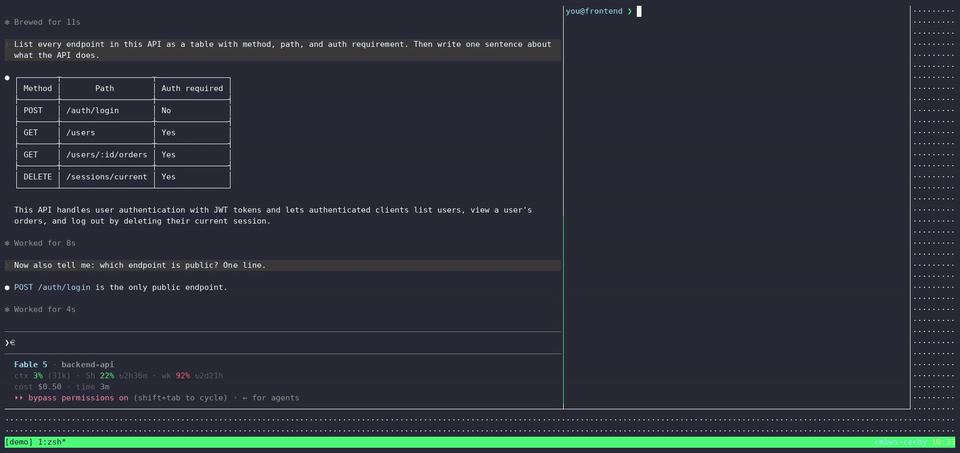

# claude-coordinate

**Local cross-session coordination for Claude Code.** Make independently started
Claude Code sessions on one machine discover each other, exchange messages —
**injected live into the receiving session's terminal, Telegram-style** — and
watch any session's conversation as it happens. No server, no network listener,
no cloud: everything is files under your own `~/.claude`, owner-only permissions.

Built because [anthropics/claude-code#37213](https://github.com/anthropics/claude-code/issues/37213)
and [#24798](https://github.com/anthropics/claude-code/issues/24798) are real:
sessions are silos. The official experimental
[agent teams](https://code.claude.com/docs/en/agent-teams) feature covers
lead-spawned teammates, but nothing connects two sessions you *already* have
open in different projects. This does.



```text
┌─ session A (your api repo) ─┐         ┌─ session B (your frontend repo) ─┐
│ > /coordinate ask frontend  │  live   │ ▌ coordination message arrived    │
│   which props changed       │ ──────► │ ● Reading src/components…         │
│                             │ ◄────── │ ● Calling coordinate reply…       │
│ « Button lost `variant`,    │  reply  │                                   │
│   Modal gained `onClose` »  │         │                                   │
└─────────────────────────────┘         └───────────────────────────────────┘
```

## What you get

| Piece | What it does |
|---|---|
| `coordinate-channel` (plugin) | An MCP **channel** server: messages from other sessions appear *inside* the running session's TUI within ~2 s and are answered as normal turns, with replies routed back to the sender. Same harness mechanism as the official Telegram channel, but the transport is your local filesystem. |
| `claude-coordinate` (CLI) | `list` sessions on the machine (who's active, where, doing what) · `watch <target>` / `watch --all` — live, read-only pretty-printed feed of any session's conversation · `send <target> "msg"` — message a session and stream back its reply. |
| `/coordinate` (skill) | Teaches any Claude session to use the CLI: `/coordinate <task>` makes it pick the right peer session, brief it, iterate, and report back. |

Sessions **without** the channel are still reachable: `send` falls back to a
context-aware transcript resume (`claude -p --resume`) — the reply is real, it
just doesn't render in an already-open TUI until reopened.

## Install

**Recommended:** hand your Claude Code session the agent setup guide and let it
do the work with verification at each step:

```text
Read https://raw.githubusercontent.com/evrimagaci/claude-coordinate/main/SETUP-FOR-CLAUDE.md and follow it.
```

**Manual:** see the same file — it's written to be human-followable too.

## Use

```bash
# a "coordinatable" session (live injection enabled):
claude --dangerously-load-development-channels server:coordinate

# from anywhere else on the machine:
claude-coordinate list                  # who's running where
claude-coordinate send my-api "did the auth middleware change today?"
claude-coordinate watch my-api          # live feed of that session (Ctrl-C stops)
claude-coordinate watch --all           # one feed for every session on the machine
```

Targets are a session-id prefix or a project-path substring; `send` prefers a
live channel and falls back to transcript resume.

## Security model — read before installing

- **Local filesystem only.** There is no socket, no port, no network code in
  any component. Messages are files under `~/.claude/channels/coordinate/`
  (created `0700`); only your own user can write them. The threat model is
  "anything that can already write your home directory" — which can already
  edit your shell rc.
- **A channel is input injection into an agent, by design.** Any process
  running as your user can make a channel-enabled session *do things* (same
  trust level as typing into the terminal yourself). Only enable the channel
  flag for sessions on machines where every same-user process is yours.
- **The `--dangerously-load-development-channels` flag** is Claude Code's
  escape hatch for channels not on Anthropic's server-side allowlist (which
  no third-party channel can self-join today). Its warning — don't run
  channels you downloaded off the internet — applies to this repo too:
  **read `coordinate-channel/server.js` before enabling it.** It's ~190
  dependency-free lines; ten minutes, no excuses. The launch confirmation
  prompt is per-session and intentional.
- **Replies are path-constrained** (the channel will only write reply files
  under `/tmp/` or its own state dir), the sender CLI refuses to resume-write
  a session that was active in the last 90 s (anti-interleave guard), and dead
  sessions are dropped from the registry automatically.
- **Transcripts contain secrets** (tool output echoes env vars, tokens…).
  `watch` only shows you what's already on your own disk — never pipe its
  output anywhere shared without redaction.

## Compatibility & limitations

- Linux first; macOS works with `COORDINATE_CHANNEL=1` set at launch for
  channel sessions (no `/proc` for flag auto-detection). Windows: untested.
- Live injection is per-turn (a busy session answers when its current turn
  ends — messages queue like typed input). `watch` granularity is per-turn,
  not per-token.
- The channels API is **experimental** in Claude Code; this may break on
  upgrades. Built against v2.1.7x.
- One machine. For cross-machine coordination you want an actual remote
  channel (Telegram/Slack) or a relay — out of scope here by design.

## How it works (short version)

A channel-enabled session spawns the MCP server, which registers itself in
`~/.claude/channels/coordinate/sessions/<pid>.json` and watches an inbox
directory. `claude-coordinate send` drops a JSON message file there (atomic
rename, unique names — concurrent senders can't collide); the server pushes
`notifications/claude/channel` and the Claude Code harness injects it as a
live turn. The session answers through the channel's `reply` tool, which
appends to the sender's unique reply file; the sender streams it. Discovery
(`list`) and viewing (`watch`) read Claude Code's own append-only session
transcripts — read-only by construction.

## License

MIT — see [LICENSE](LICENSE).
